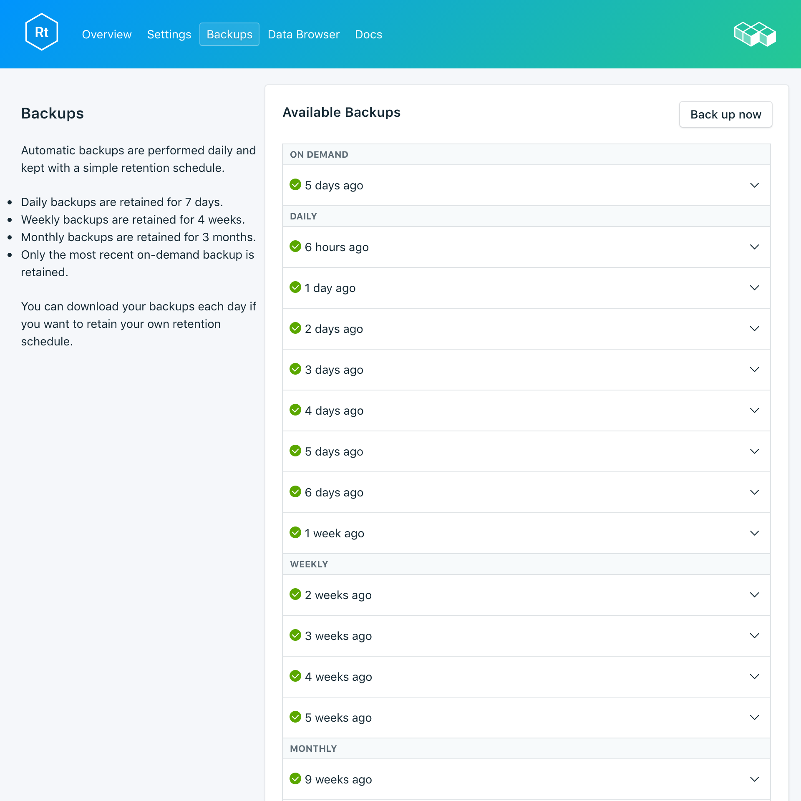
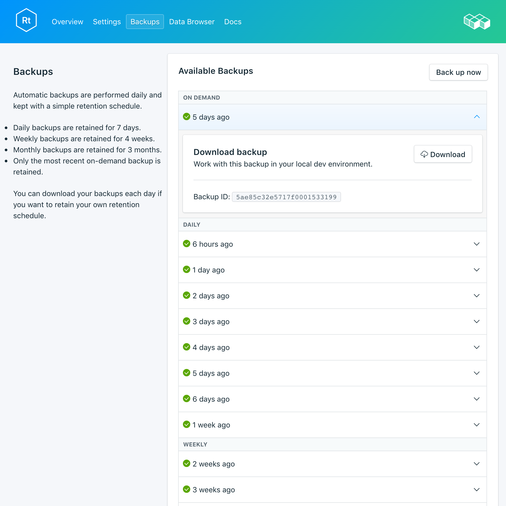

---

copyright:
  years: 2017,2018
lastupdated: "2018-03-02"

subcollection: compose-for-rethinkdb

---

{:new_window: target="_blank"}
{:shortdesc: .shortdesc}
{:screen: .screen}
{:codeblock: .codeblock}
{:pre: .pre}

# Backups
{: #dashboard-backups}

You can create and download backups from the _Backups_ tab of the _Manage_ page of your service dashboard. Daily, weekly, monthly, and on-demand backups are kept according to the following schedule:

Backup type|Retention schedule
----------|-----------
Daily|Daily backups are retained for 7 days
Weekly|Weekly backups are retained for 4 weeks
Monthly|Monthly backups are retained for 3 months
On-demand|One on-demand backup is retained. The retained backup is always the most recent on-demand backup.
{: caption="Table 1. Backup retention schedule" caption-side="top"}

Backup schedules and retention policies are fixed. If you need to keep more backups than the retention schedule allows, you should download backups and retain archives according to your business requirements.

## Viewing existing backups

Daily backups of your database are automatically scheduled. To view your existing backups, go to the *Manage* page of your service dashboard. 

  

Click the corresponding row to expand the options for any available backup.

   

### Using the API to view existing backups

A list of backups is available at the `GET /2016-07/deployments/:id/backups` endpoint. The Foundation Endpoint, the service instance ID, and the deployment ID are shown on the service _Overview_ page. For example:

``` 
https://composebroker-dashboard-public.mybluemix.net/api/2016-07/instances/$INSTANCE_ID/deployments/$DEPLOYMENT_ID/backups
```  

## Creating a backup on demand

To create a manual backup, go to the *Manage* page of your service dashboard and click *Backup now*.

### Using the API to create a backup

Send a POST request to the backups endpoint to initiate a manual backup: `POST /2016-07/deployments/:id/backups`. It returns immediately with the recipe ID and information about the backup as it is running. You must check the backups endpoint to see whether the backup is complete, and find its backup_id before you can use it. Use `GET /2016-07/deployments/:id/backups/`.

## Downloading a backup

To download a backup, navigate to the *Manage* page of your service dashboard and click *Download* in the corresponding row for the backup you want to download.

### Using the API to download a backup

Find the backup you would like to restore from on the _Backups_ page on your service and copy the backup_id, or use the `GET /2016-07/deployments/:id/backups` to find a backup and its backup_id through the Compose API. Then, use the backup_id to find information and a download link for a specific backup: `GET /2016-07/deployments/:id/backups/:backup_id`.

## Backup contents

RethinkDB backups use the `dump` command from the RethinkDB command-line utility on your running database cluster to back up your entire deployment. It saves database and table contents as well as metadata. The `dump` command does use some cluster resources, but does not lock-out your clients and can be run on a live cluster. Compose provides backups for RethinkDB deployments that are in a format that `rethinkdb restore` can use directly.

## Using a backup with a local database

Since your RethinkDB backups are available for you to download, you can get a local instance of your deployment up and running.

1. Install [rethink](https://www.rethinkdb.com/docs/install/)
2. Install the [python driver](https://www.rethinkdb.com/docs/install-drivers/python/) in your path.
3. Download your compressed backup file. You do not need to unpack the backup archive file, the RethinkDB tools know how to handle it.
4. To spin up RethinkDB, run the `rethinkdb` command in one terminal window, and in a separate terminal window navigate to the location of your downloaded backup and run `rethinkdb restore backup.tar.gz`.

Open a browser window and navigate to `locahost:8080` to see the RethinkDB UI and your data.

## Bringing a Local Backup into your service

If you have a backup file locally that you would like to restore to {{site.data.keyword.composeForRethinkDB}} you can do this using `rethinkdb restore`.

1. Install [rethink](https://www.rethinkdb.com/docs/install/)
2. Install the [python driver](https://www.rethinkdb.com/docs/install-drivers/python/) in your path.
3. Download the certificate from the *Overview* page of your service and save it locally as compose.cert.
4. Restore from the backup by using the following command:

  ```
  rethinkdb restore -c <host>:<port> --tls-cert compose.cert -p backup.tar.gz
  ```

The host and port values can be found in your connection string, which you can find on the *Overview* page of your service. The `-p` in the command prompts for the _Authentication Credential_.

**Note:** If you are restoring into an existing deployment, you might have to use `--force` to overwrite existing tables.