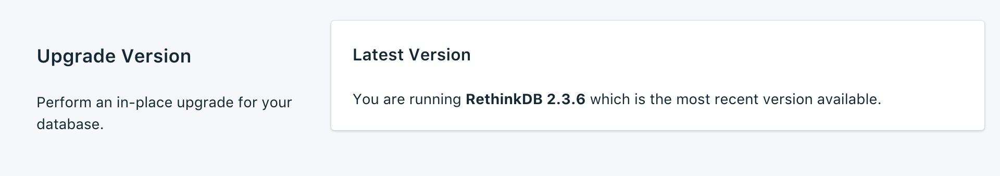
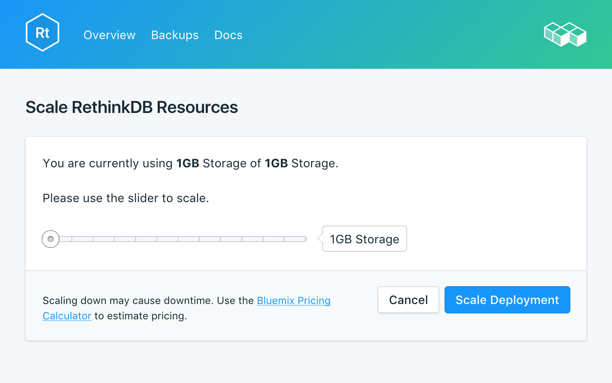
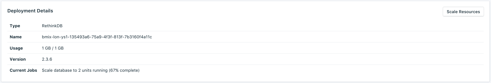
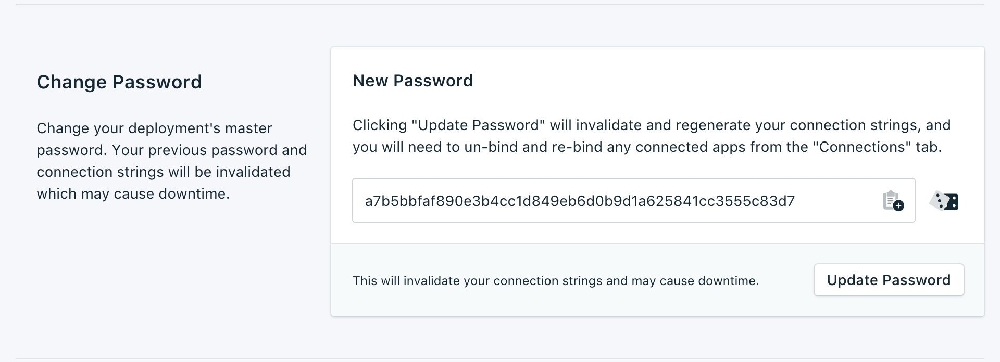
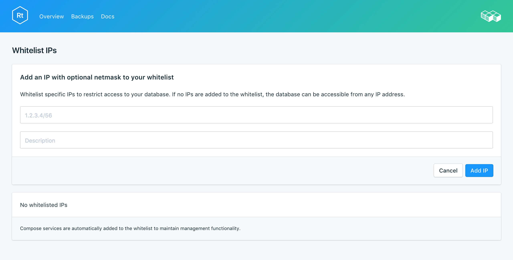

---

Copyright:
  Years: 2017
lastupdated: "2017-10-23"
---

{:new_window: target="_blank"}
{:shortdesc: .shortdesc}
{:screen: .screen}
{:codeblock: .codeblock}
{:pre: .pre}
{:tip: .tip}

# Settings

These features allow you to adapt your {{site.data.keyword.composeForRethinkDB}} service to better suit your needs and requirements.

## Upgrade Version

If there is a new version of the database available, a drop-down menu appears, allowing you to select which version you would like to upgrade to. Otherwise, your service is on the newest version available, and the panel displays the current version information.

## Scaling Resources

If your service needs additional storage, or you want to reduce the amount of storage allocated to your service, you can do this by scaling resources.

1. Navigate to your service's _Overview_ page.
2. In the _Deployment Details_ panel, click **Scale Resources**. The Scale Resouces page opens.

    

3. Adjust the slider to raise or lower the storage allocated to the {{site.data.keyword.composeForRethinkDB}} service. Move the slider to the left to reduce the amount of storage, or move it to the right to increase the storage.
4. Click **Scale Deployment** to trigger the rescaling and return to the dashboard overview. A 'Scaling initiated' message appears at the top of the page to let you know the rescaling is in progress.

    

    When the scaling is complete the _Deployment Details_ pane updates to show the current usage and the new value for the available storage.

## Change Password

You might find it necessary to change the password of your service. You can do so using _Update Password_. 

A new, randomly generated password will appear, or you can type your own password into the field. To regenerate another password, click on the dice to the right of the field. 
  

The changes take effect when you click on the **Update Password** button. This will change the credentials that you and your services use to connect and is a part of your service's connection string. The _Deployment Details_ pane will show the progress of the running job.

### Updating Connected Applications
Changing the password will invalidate the existing connection string and generate a new one. This will cause a service interruption until connected applications are updated with the new connection string. You will have to do this by suppling the new connection string to your applications.

More information on connecting your applications is in [Connecting a {{site.data.keyword.Bluemix_notm}} Application](./connecting-bluemix-app.html).
and [Connecting an external application](./connecting-external.html).

## Using Whitelists

If you want to restrict access to your databases, you can whitelist specific IP addresses or ranges of IP addresses on your service. When there are no IP addresses in the whitelist, the whitelist is disabled and the deployment will accept connections from any system on the internet.

### IP Addresses
The *IP* field can take a single complete IPv4 address or IPv6 address with or without a netmask. Without a netmask, incoming connections must come from exactly that IP address. 

Note that although the IP entry allows for IPv6, no Compose deployments are currently available to IPv6 networking and so these addresses cannot be filtered on.

### Netmasks
To allow a connection from a specified range of IP addresses, use a netmask. The IP address must be fully specified when using a netmask. That means entering, for example, 192.168.1.0/24 rather than 192.168.1/24.

### Description
The *Description* can be any user-significant text for identifying the whitelist entry - a customer name, project identifier or employee number, for example. The description field is required.

### Compose Services
Whitelist entries are automatically added to Compose's servers to allow them to connect.

### Removal
To remove an IP address or netmask from the Whitelist, click the *Remove* entry displayed next to it.
When all entries on the whitelist are removed, the whitelist will be disabled and all IP addresses will be accepted by the TCP access portals. 
