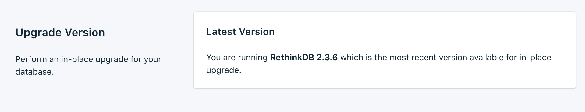
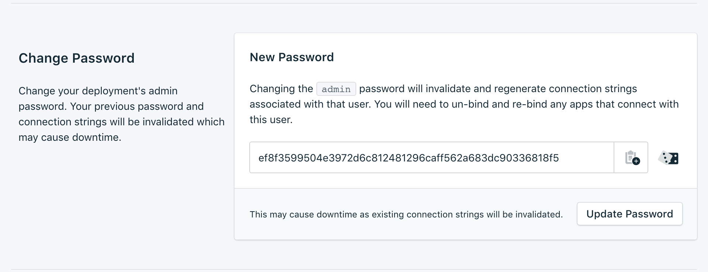

---

Copyright:
  years: 2017,2018
lastupdated: "2017-11-20"
---

{:new_window: target="_blank"}
{:shortdesc: .shortdesc}
{:screen: .screen}
{:codeblock: .codeblock}
{:pre: .pre}
{:tip: .tip}

# Settings

Use these features to adapt your {{site.data.keyword.composeForRethinkDB_full}} service to suit your needs and requirements.

## Upgrade Version

If a new version of the database is available, a drop-down menu appears, allowing you to select which version you would like to upgrade to. Otherwise, your service is on the newest version available, and the pane displays the current version information.

## Scaling Resources

You can increase or reduce the amount of storage that is allocated to your service by scaling resources.

1. Go to your service's _Overview_ page.
2. In the _Deployment Details_ pane, click **Scale Resources**. The Scale Resources page opens.

    

3. Adjust the slider to increase or reduce the storage that is allocated to the {{site.data.keyword.composeForRethinkDB}} service. Move the slider to the left to reduce the amount of storage, or move it to the right to increase the storage.
4. Click **Scale Deployment** to trigger the rescaling and return to the dashboard overview. 

When the scaling is complete the _Deployment Details_ pane updates to show the current usage and the new value for the available storage.

## Change Password

You might find it necessary to change the password of your service. You can do so by using _Update Password_. 

A new, randomly generated password appears, or you can type your own password into the field. To regenerate another password, click the dice to the right of the field. 
  

Click **Update Password**. You will be asked to confirm the change. Click **Update Password** in the dialog to confirm the new password, or cancel to cancel the change. The _Deployment Details_ pane shows the progress of the running job.

**Note:** Changing the password changes the credentials that you and your services use to connect, and invalidates your service's connection string. It can also result in downtime.

### Updating Connected Applications
Changing the password invalidates the existing connection string and generate a new one. This causes a service interruption until connected applications are updated with the new connection string. You must do this by suppling the new connection string to your applications.

For more information on connecting your applications, see [Connecting an {{site.data.keyword.cloud}} Application](./connecting-bluemix-app.html), and [Connecting an external application](./connecting-external.html).

## Using Whitelists

If you want to restrict access to your databases, you can whitelist specific IP addresses or ranges of IP addresses on your service. When there are no IP addresses in the whitelist, the whitelist is disabled and the deployment accepts connections from any system on the internet.

### IP Addresses
The *IP* field can take a single complete IPv4 address or IPv6 address with or without a netmask. Without a netmask, incoming connections must come from exactly that IP address. 

Although the IP entry allows for IPv6, no Compose deployments are currently available to IPv6 networking and so these addresses cannot be filtered on.

### Netmasks
To allow a connection from a specified range of IP addresses, use a netmask. The IP address must be fully specified when using a netmask. That means entering, for example, 192.168.1.0/24 rather than 192.168.1/24.

### Description
The *Description* can be any user-significant text for identifying the whitelist entry - a customer name, project identifier, or employee number, for example. The description field is required.

### Compose Services
Whitelist entries are automatically added to Compose's servers to allow them to connect.

### Removal
To remove an IP address or netmask from the Whitelist, click the *Remove* entry displayed next to it.
When all entries on the whitelist are removed, the whitelist is disabled and all IP addresses are accepted by the TCP access portals. 
