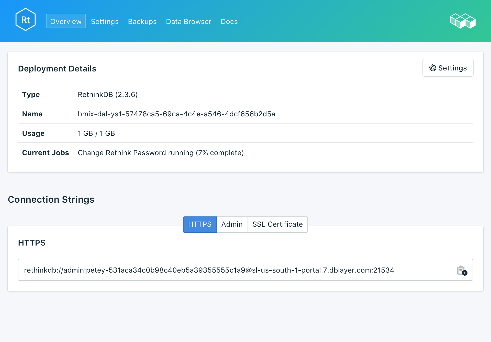

---

Copyright:
  Years: 2017
lastupdated: "2017-10-16"
---

{:new_window: target="_blank"}
{:shortdesc: .shortdesc}
{:screen: .screen}
{:codeblock: .codeblock}
{:pre: .pre}

# Updating the Service Password

You might find it necessary to change the password of your service. You can do so using _Update Password_. 

A new, randomly generated password will appear, or you can type your own password into the field. To regenerate another password, click on the dice to the right of the field. 
  

The changes take effect when you click on the **Update Password** button. This will change the credentials that you and your services use to connect and is a part of your service's connection string. The _Deployment Details_ pane will show the progress of the job that is now in progress:

## Updating Connected Applications
Changing the password will invalidate the existing connection string and generate a new one. This will cause a service interruption until connected applications are updated with the new connection string. You will have to do this by suppling the new connection string to your applications.

More information on connecting your applications is in [Connecting a Bluemix Application](./connecting-bluemix-app.html).
and [Connecting an external application](./connecting-external.html).

