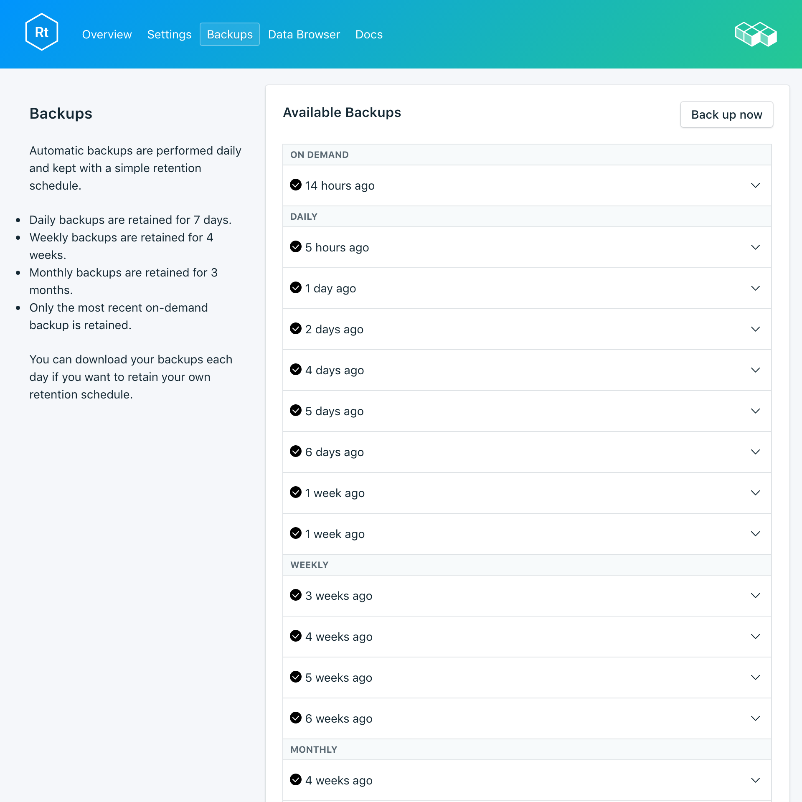

---

copyright:
  years: 2017
lastupdated: "2017-10-16"
---

{:new_window: target="_blank"}
{:shortdesc: .shortdesc}
{:screen: .screen}
{:codeblock: .codeblock}
{:pre: .pre}

# Sicherungen
{: #backups}

Sie können Sicherungen erstellen und über die Seite *Verwalten* Ihres Service-Dashboards herunterladen. Es sind sowohl geplante als auch manuelle Sicherungen verfügbar.

## Vorhandene Sicherungen anzeigen

Tägliche Sicherungen Ihrer Datenbank werden automatisch geplant. Navigieren Sie zum Anzeigen Ihrer vorhandenen Sicherungen zu der Seite *Verwalten* Ihres Service-Dashboards. 



Klicken Sie in eine Zeile, um die Optionen für die entsprechende verfügbare Sicherung zu erweitern.

 

## Sicherung bedarfsgerecht erstellen

Neben geplanten Sicherungen können Sie manuelle Sicherungen erstellen. Navigieren Sie zum Erstellen einer manuellen Sicherung zu der Seite *Verwalten* Ihres Service-Dashboards und klicken Sie auf *Jetzt sichern*.

## Sicherung herunterladen

Navigieren Sie zum Herunterladen einer Sicherung zu der Seite *Verwalten* Ihres Service-Dashboards und klicken Sie in der entsprechenden Zeile mit der Sicherung, die Sie herunterladen wollen, auf *Herunterladen*.

## Inhalt von Sicherungen

RethinkDB-Sicherungen verwenden für die Sicherung Ihrer gesamten Bereitstellung den Befehl `dump` des Befehlszeilendienstprogramms von RethinkDB in Ihrem aktiven Datenbankcluster. Damit werden der Datenbank- und Tabelleninhalt sowie die Metadaten gespeichert. `dump` verwendet einige Clusterressourcen, sperrt aber Ihre Clients nicht aus und kann in einem Live-Cluster ausgeführt werden. Compose stellt Sicherungen für RethinkDB-Bereitstellungen bereit, deren Format `rethinkdb restore` direkt verwenden kann.

## Sicherung mit lokaler Datenbank verwenden

Da Ihre RethinkDB-Sicherungen für Sie zum Download verfügbar sind, können Sie eine lokale Instanz Ihrer Bereitstellung abrufen, die betriebsbereit ist.

1. Installieren Sie [rethink](https://www.rethinkdb.com/docs/install/).
2. Installieren Sie den [Python-Treiber](https://www.rethinkdb.com/docs/install-drivers/python/) in Ihrem Pfad.
3. Laden Sie Ihre komprimierte Sicherungsdatei herunter. Sie brauchen die Sicherungsarchivdatei nicht zu entpacken, denn die RethinkDB-Tools wissen, wie damit umzugehen ist.
4. Nehmen Sie RethinkDB in Betrieb, führen Sie den Befehl `rethinkdb` in einem Terminalfenster aus und navigieren Sie in einem separaten Terminalfenster an die Position Ihrer heruntergeladenen Sicherung und führen Sie `rethinkdb restore backup.tar.gz` aus.

Öffnen Sie ein Browserfenster und navigieren Sie zu `locahost:8080`, um die RethinkDB-Benutzerschnittstelle und Ihre Daten anzuzeigen.

## Lokale Sicherung in Ihren Service integrieren

Wenn Sie eine lokale Sicherungsdatei haben, die Sie in {{site.data.keyword.composeForRethinkDB}} wiederherstellen wollen, können Sie das mit `rethinkdb restore` tun.

1. Installieren Sie [rethink](https://www.rethinkdb.com/docs/install/).
2. Installieren Sie den [Python-Treiber](https://www.rethinkdb.com/docs/install-drivers/python/) in Ihrem Pfad.
3. Laden Sie das Zertifikat von der Seite *Übersicht* Ihres Service herunter und speichern Sie es lokal als 'compose.cert'.
4. Führen Sie die Wiederherstellung der Sicherung mit dem folgenden Befehl aus:

  ```
  rethinkdb restore -c <host>:<port> --tls-cert compose.cert -p backup.tar.gz
  ```

Sie finden die Host- und Portwerte in Ihrer Verbindungszeichenfolge, die sich auf der Seite *Übersicht* Ihres Service befindet. Die Option `-p` in dem Befehl fordert zur Eingabe des _Authentifizierungsnachweises_ auf.

**Hinweis:** Wenn Sie eine Wiederherstellung in eine vorhandene Bereitstellung vornehmen, müssen Sie die vorhandenen Tabellen möglicherweise mit der Option `--force` überschreiben.
