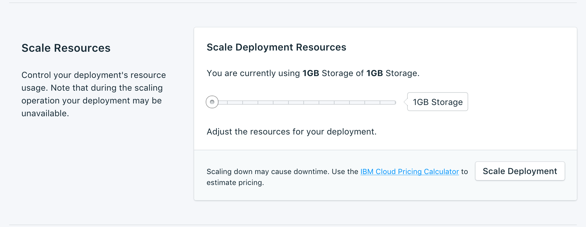
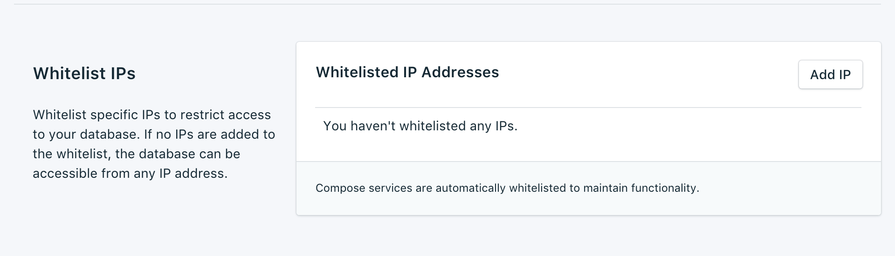

---

Copyright:
  Years: 2017
lastupdated: "2017-10-23"
---

{:new_window: target="_blank"}
{:shortdesc: .shortdesc}
{:screen: .screen}
{:codeblock: .codeblock}
{:pre: .pre}
{:tip: .tip}

# Einstellungen

Mit diesen Funktionen können Sie Ihren {{site.data.keyword.composeForRethinkDB_full}}-Service besser an Ihre Bedürfnisse und Anforderungen anpassen.

## Upgradeversion

Wenn eine neue Version der Datenbank verfügbar ist, wird ein Dropdown-Menü angezeigt, in dem Sie auswählen können, auf welche Version Sie das Upgrade durchführen wollen. Andernfalls ist Ihr Service auf dem neuesten verfügbaren Stand und die Anzeige zeigt die aktuellen Versionsinformationen an.

## Ressourcen skalieren

Wenn Ihr Service zusätzlichen Speicher benötigt oder Sie den Speicherplatz verringern wollen, der Ihrem Service zugeordnet ist, können Sie dazu die Ressourcen skalieren.

1. Navigieren Sie zur Seite _Übersicht_ Ihres Service.
2. Klicken Sie in der Anzeige _Bereitstellungsdetails_ auf **Ressourcen skalieren**. Die Seite 'Ressourcen skalieren' wird geöffnet.

    

3. Passen Sie den Schieberegler an, um den Speicher zu erhöhen oder zu verringern, der dem {{site.data.keyword.composeForRethinkDB}}-Service zugeordnet ist. Verschieben Sie den Schieberegler nach links, um den Speicherplatz zu verringern, oder nach rechts, um ihn zu erhöhen.
4. Klicken Sie auf **Bereitstellung skalieren**, um die Neuskalierung auszulösen und zur Dashboardübersicht zurückzukehren. Oben auf der Seite wird die Nachricht 'Skalierung eingeleitet' angezeigt, damit Sie wissen, dass die Neuskalierung läuft. 

    

    Nach dem Abschluss der Skalierung wird die Anzeige _Bereitstellungsdetails_ aktualisiert und zeigt die aktuelle Nutzung sowie den neuen Wert für den verfügbaren Speicher an.

## Kennwort ändern

Möglicherweise finden Sie es erforderlich, das Kennwort Ihres Service zu ändern. Verwenden Sie dazu die Option _Kennwort aktualisieren_. 

Es wird ein neues, zufällig generiertes Kennwort angezeigt. Alternativ können Sie in dem Feld ein eigenes Kennwort eingeben. Klicken Sie zum Erstellen eines anderen Kennworts rechts neben dem Feld auf den Würfel. 
  

Die Änderungen werden wirksam, wenn Sie auf die Schaltfläche **Kennwort aktualisieren** klicken. Damit werden die Berechtigungsnachweise geändert, mit denen Sie und Ihre Services eine Verbindung herstellen und die zur Verbindungszeichenfolge Ihres Service gehören. In der Anzeige _Bereitstellungsdetails_ wird der Verarbeitungsfortschritt des Jobs angezeigt.

### Verbundene Anwendungen aktualisieren
Die Änderung des Kennworts bewirkt, dass die vorhandene Verbindungszeichenfolge ungültig wird und eine neue generiert wird. Dies führt zu einer Serviceunterbrechung, bis die verbundenen Anwendungen mit der neuen Verbindungszeichenfolge aktualisiert werden. Dazu müssen Sie Ihren Anwendungen die neue Verbindungszeichenfolge zur Verfügung stellen.

Weitere Informationen zum Verbinden Ihrer Anwendungen finden Sie in den Abschnitten [{{site.data.keyword.cloud}}-Anwendung verbinden](./connecting-bluemix-app.html) und [Externe Anwendung verbinden](./connecting-external.html).

## Whitelists verwenden

Wenn Sie den Zugriff auf Ihre Datenbank beschränken wollen, können Sie bestimmte IP-Adressen oder IP-Adressbereiche für Ihren Service auf eine Whitelist setzen. Wenn in der Whitelist keine IP-Adressen enthalten sind, wird die Whitelist inaktiviert und die Bereitstellung akzeptiert Verbindungen von jedem System im Internet.

### IP-Adressen
Das Feld *IP* kann eine einzelne vollständige IPv4- oder IPv6-Adresse mit oder ohne Netzmaske annehmen. Ohne Netzmaske müssen eingehende Verbindungen von genau dieser IP-Adresse kommen. 

Beachten Sie Folgendes: Zwar lässt der IP-Eintrag IPv6 zu, doch ist derzeit keine Compose-Bereitstellung für den IPv6-Netzbetrieb verfügbar, sodass keine Filterung dieser Adressen möglich ist.

### Netzmasken
Verwenden Sie eine Netzmaske, um eine Verbindung von einem angegebenen IP-Adressbereich zuzulassen. Bei Verwendung einer Netzmaske muss die IP-Adresse vollständig angegeben werden. Es muss also beispielsweise 192.168.1.0/24 statt 192.168.1/24 eingegeben werden.

### Beschreibung
Die *Beschreibung* kann ein beliebiger für den Benutzer hilfreicher Text zum Identifizieren des Eintrags in der Whitelist sein, beispielsweise ein Kundenname, eine Projekt-ID oder eine Personalnummer. Das Beschreibungsfeld ist erforderlich.

### Compose-Services
Einträge in die Whitelist werden automatisch zu den Compose-Servern hinzugefügt, damit sie eine Verbindung herstellen können.

### Entfernen
Klicken Sie, wenn Sie eine IP-Adresse oder Netzmaske aus der Whitelist entfernen wollen, auf den neben ihr angezeigten Eintrag *Entfernen*. Wenn alle Einträge in der Whitelist entfernt werden, wird die Whitelist inaktiviert und die TCP-Zugriffsportale akzeptieren alle IP-Adressen. 
