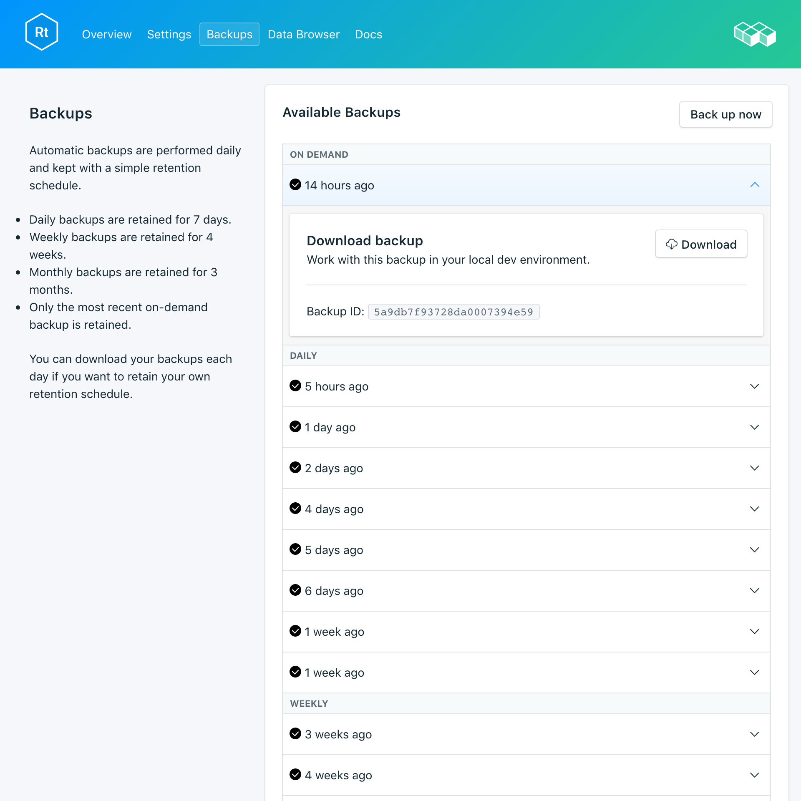

---

copyright:
  years: 2017
lastupdated: "2017-10-16"
---

{:new_window: target="_blank"}
{:shortdesc: .shortdesc}
{:screen: .screen}
{:codeblock: .codeblock}
{:pre: .pre}

# Sauvegardes
{: #backups}

Vous pouvez créer et télécharger des sauvegardes à partir de la page *Gérer* du tableau de bord de votre service. Les sauvegardes planifiées comme manuelles sont disponibles.

## Affichage des sauvegardes existantes

Des sauvegardes quotidiennes de votre base de données sont automatiquement planifiées. Pour afficher vos sauvegardes existantes, accédez à la page *Gérer* du tableau de bord de votre service. 


Cliquez sur la ligne correspondante pour développer les options de chaque sauvegarde disponible.

 

## Création d'une sauvegarde à la demande

Outre les sauvegardes planifiées, vous pouvez créer une sauvegarde manuelle. Pour créer une sauvegarde manuelle, accédez à la page *Gérer* du tableau de bord de votre service et cliquez sur *Backup now*.

## Téléchargement d'une sauvegarde

Pour télécharger une sauvegarde, accédez à la page *Gérer* du tableau de bord de votre service et cliquez sur *Télécharger* sur la ligne correspondant à la sauvegarde que vous voulez télécharger.

## Contenu de sauvegarde

Les sauvegardes RethinkDB utilisent la commande `dump` de l'utilitaire de ligne de commande RethinkDB sur votre cluster de bases de données en cours d'exécution pour sauvegarder l'intégralité de votre déploiement. Elle sauvegarde le contenu des bases de données et des tables ainsi que des métadonnées. `dump` utilise certaines ressources du cluster mais ne verrouille pas vos clients et peut être exécutée sur un cluster actif. Compose fournit des sauvegardes pour des déploiements RethinkDB dans un format que la commande `rethinkdb restore` peut utiliser directement.

## Utilisation d'une sauvegarde avec une base de données locale

Etant donné que vos sauvegardes RethinkDB sont disponibles pour téléchargement, vous pouvez obtenir une instance locale opérationnelle de votre déploiement.

1. Installez [rethink](https://www.rethinkdb.com/docs/install/)
2. Installez le [pilote Python](https://www.rethinkdb.com/docs/install-drivers/python/) dans votre chemin.
3. Téléchargez votre fichier de sauvegarde compressé. Vous n'êtes pas obligé de décompresser le fichier d'archive de sauvegarde, les outils RethinkDB s'en chargent.
4. Pour lancer RethinkDB, exécutez la commande `rethinkdb` dans une fenêtre de terminal puis, dans une autre fenêtre de terminal, accédez à l'emplacement de votre de sauvegarde téléchargée et exécutez `rethinkdb restore backup.tar.gz`.

Ouvrez une fenêtre de navigateur et accédez à `locahost:8080` pour afficher l'interface utilisateur RethinkDB et vos données.

## Apport d'une sauvegarde locale dans votre service

Si vous disposez d'un fichier de sauvegarde en local que vous voulez restaurer sur {{site.data.keyword.composeForRethinkDB}}, la commande `rethinkdb restore` vous le permet.

1. Installez [rethink](https://www.rethinkdb.com/docs/install/)
2. Installez le [pilote Python](https://www.rethinkdb.com/docs/install-drivers/python/) dans votre chemin.
3. Téléchargez le certificat depuis la page *Vue d'ensemble* de votre service et sauvegardez-le en local sous le nom compose.cert.
4. Procédez à la restauration à partir de la sauvegarde avec la commande suivante :

  ```
  rethinkdb restore -c <host>:<port> --tls-cert compose.cert -p backup.tar.gz
  ```

Les valeurs d'hôte et de port sont indiquées dans votre chaîne de connexion, disponible sur la page *Vue d'ensemble* de votre service. L'élément `-p` de la commande demande les _données d'authentification_.

**Remarque :** Si vous restaurez dans un déploiement existant vous devrez sans doute utiliser `--force` pour remplacer les tables existantes.
