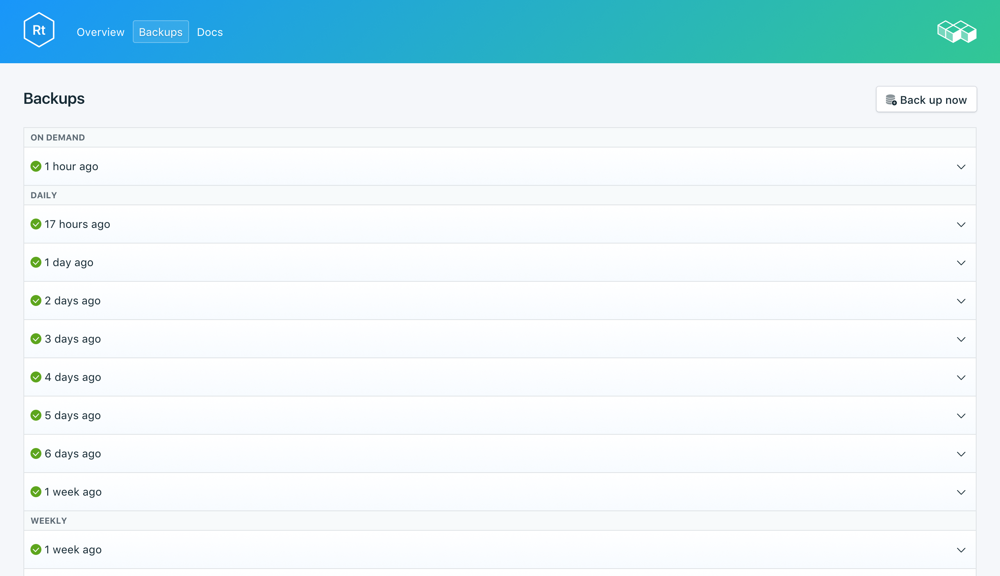
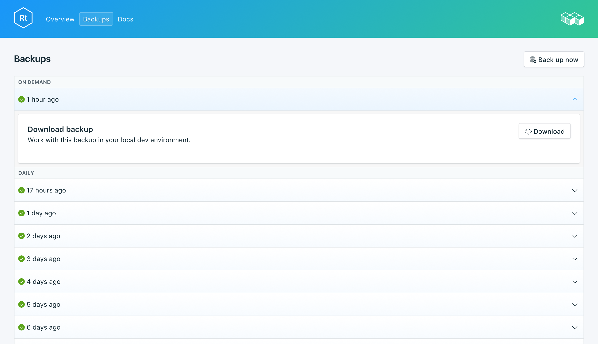

---

copyright:
  years: 2017,2018
lastupdated: "2018-03-02"
---

{:new_window: target="_blank"}
{:shortdesc: .shortdesc}
{:screen: .screen}
{:codeblock: .codeblock}
{:pre: .pre}

# バックアップ
{: #backups}

サービス・ダッシュボードの_「管理」_ページの_「バックアップ (Backups)」_タブから、バックアップの作成とダウンロードを行えます。 日次、週次、月次、オンデマンドでのバックアップを使用できます。 これらは、以下のスケジュールに従って保持されます。

バックアップ・タイプ|保持スケジュール
----------|-----------
日次|日次バックアップは 7 日間保持されます
週次|週次バックアップは 4 週間保持されます
月次|月次バックアップは 3 カ月保持されます
オンデマンド|オンデマンド・バックアップは 1 つ保持されます。 保持されるバックアップは、常に最新のオンデマンド・バックアップです。
{: caption="表 1. バックアップ保持スケジュール" caption-side="top"}

バックアップ・スケジュールと保持ポリシーは固定されています。 保持スケジュールで許可されているよりも多くのバックアップを保持する必要がある場合は、バックアップをダウンロードし、ビジネス要件に従ってアーカイブを保持する必要があります。

## 既存のバックアップの表示

データベースの日次バックアップは自動的にスケジュールされます。 既存のバックアップを表示するには、サービス・ダッシュボードの*「管理」*ページに移動します。 

  

対応する行をクリックして、選択可能バックアップのオプションを展開します。

   

### API を使用した既存のバックアップの表示

バックアップのリストを `GET /2016-07/deployments/:id/backups` エンドポイントで取得できます。サービス・インスタンス ID を含むファウンデーション・エンドポイントと、デプロイメント ID は、両方ともサービスの_「概要」_に表示されます。例: 
``` 
https://composebroker-dashboard-public.mybluemix.net/api/2016-07/instances/$INSTANCE_ID/deployments/$DEPLOYMENT_ID/backups
```  

## オンデマンドでのバックアップ作成

スケジュールされたバックアップだけでなく、バックアップを手作業で作成することができます。 手動でバックアップを作成する場合は、サービス・ダッシュボードの*「管理」*ページに移動して、*「今すぐバックアップ」*をクリックします。

### API を使用したバックアップの作成

backups エンドポイントに POST 要求 `POST /2016-07/deployments/:id/backups` を送信して、手動でバックアップを開始できます。この要求はただちに戻り、実行中のバックアップのレシピ ID と情報を返します。バックアップを使用するには、バックアップが完了したかどうかを backups エンドポイントで確認し、バックアップ ID を見つける必要があります。`GET /2016-07/deployments/:id/backups/` を使用します。

## バックアップのダウンロード

バックアップをダウンロードするには、サービス・ダッシュボードの*「管理」*ページに移動し、ダウンロードするバックアップに対応する行で*「ダウンロード」*をクリックします。

### API を使用したバックアップのダウンロード

サービスの_「バックアップ」_ページで、リストアするバックアップを見つけて backup_id をコピーするか、`GET /2016-07/deployments/:id/backups` を使用して、Compose API でバックアップとその backup_id を見つけます。次に、backup_id を使用して、特定のバックアップの情報とダウンロード・リンクを取得します (`GET /2016-07/deployments/:id/backups/:backup_id`)。

## バックアップの内容

RethinkDB バックアップは、実行中のデータベース・クラスターに対して RethinkDB コマンド・ライン・ユーティリティーの `dump` コマンドを使用して、デプロイメント全体をバックアップします。 データベースと表の内容、およびメタデータを保存します。 `dump` は、クラスターのリソースは使用しますが、クライアントをロックアウトしないので、稼働中のクラスターに対して実行できます。 Compose は、`rethinkdb restore` が直接使用できる形式で RethinkDB デプロイメントのバックアップを提供します。

## ローカル・データベースでのバックアップの使用

RethinkDB バックアップをダウンロードできるので、デプロイメントのローカル・インスタンスを実行できます。

1. [rethink](https://www.rethinkdb.com/docs/install/) をインストールします
2. パスに [python ドライバー](https://www.rethinkdb.com/docs/install-drivers/python/)をインストールします。
3. 圧縮されたバックアップ・ファイルをダウンロードします。 RethinkDB ツールはバックアップ・アーカイブ・ファイルに対応しているため、ユーザーがアーカイブ・ファイルを解凍する必要はありません。
4. RethinkDB を起動するには、1 つのターミナル・ウィンドウで `rethinkdb` コマンドを実行し、別のターミナル・ウィンドウで、バックアップをダウンロードした場所に移動して `rethinkdb restore backup.tar.gz` を実行します。

ブラウザー・ウィンドウを開いて`locahost:8080` にナビゲートし、RethinkDB UI とデータを確認します。

## ローカル・バックアップをサービスに取り込む

{{site.data.keyword.composeForRethinkDB}} に復元するバックアップ・ファイルがローカルにある場合は、`rethinkdb restore` を使用してこれを実行できます。

1. [rethink](https://www.rethinkdb.com/docs/install/) をインストールします
2. パスに [python ドライバー](https://www.rethinkdb.com/docs/install-drivers/python/)をインストールします。
3. 証明書をサービスの*「概要」*ページからダウンロードして、ローカルに compose.cert として保存します。
4. 次のコマンドを使用して、バックアップから復元します。

  ```
  rethinkdb restore -c <host>:<port> --tls-cert compose.cert -p backup.tar.gz
  ```

ホストとポートの値は、サービスの*「概要」*ページに表示される接続ストリングに含まれています。 コマンドの `-p` は、_認証資格情報_の入力を求めるプロンプトを出します。

**注意:** 既存のデプロイメントに復元する場合は、`--force` を使用して既存の表を上書きする必要がある場合があります。
