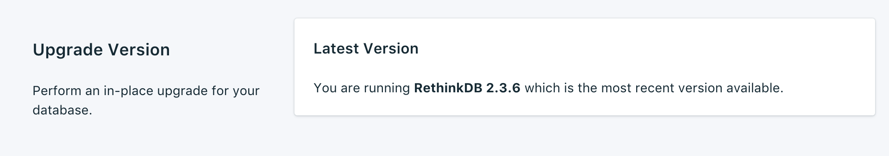
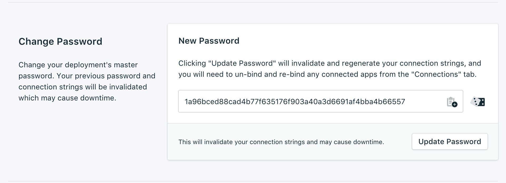

---

Copyright:
  years: 2017,2018
lastupdated: "2017-11-20"
---

{:new_window: target="_blank"}
{:shortdesc: .shortdesc}
{:screen: .screen}
{:codeblock: .codeblock}
{:pre: .pre}
{:tip: .tip}

# 設定

これらの機能を使用すると、ユーザーのニーズと条件により適合するように {{site.data.keyword.composeForRethinkDB_full}} サービスを調整できます。

## バージョンのアップグレード

新バージョンのデータベースが使用可能な場合は、ドロップダウン・メニューが表示され、どのバージョンにアップグレードするかを選択できます。 そうでない場合、現在のサービスは使用可能な最新バージョンを使用しており、現行バージョンの情報がパネルに表示されます。

## リソースの拡大縮小

サービスが追加ストレージを必要とする場合や、サービスに割り振られたストレージ量を減らす場合は、リソースを拡大縮小することによって行えます。

1. サービスの_「概要」_ページにナビゲートします。
2. _「デプロイメントの詳細 (Deployment Details)」_パネルで、**「リソースのスケール (Scale Resources)」**をクリックします。 「リソースのスケール (Scale Resouces)」ページが開きます。

    」ページ")

3. スライダーを調整して、{{site.data.keyword.composeForRethinkDB}} サービスに割り振るストレージを増減できます。 スライダーを左に移動するとストレージ量が減り、右に移動するとストレージが増えます。
4. **「デプロイメントの拡大縮小 (Scale Deployment)」**をクリックしてスケール変更をトリガーし、ダッシュボードの概要に戻ります。 

スケーリングが完了すると、_「デプロイメントの詳細 (Deployment Details)」_ペインが更新され、ストレージの現在の使用量と使用可能な量を示す新しい値が表示されます。

## パスワードの変更

サービスのパスワードを変更しなければならないことがあります。 そのためには、_「パスワードの変更 (Update Password)」_を使用します。 

ランダムに生成された新しいパスワードが表示されます。あるいは、独自のパスワードをフィールドに入力することもできます。 別のパスワードを再生成するには、フィールドの右側にあるダイスをクリックします。 
  

**「パスワードの更新 (Update Password)」**をクリックします。 変更を確認するよう求められます。 ダイアログの**「パスワードの更新 (Update Password)」**をクリックして新規パスワードを確定させるか、キャンセルして変更を取り消します。 _「デプロイメントの詳細 (Deployment Details)」_ペインに、実行中のジョブの進行状況が表示されます。

**注:** パスワードを変更すると、ユーザーとサービスが接続で使用する資格情報が変更され、サービスの接続ストリングが無効になります。 ダウン時間が発生することもあります。

### 接続されたアプリケーションの更新
パスワードを変更すると、既存の接続ストリングが無効になり、新しいパスワードが生成されます。 そのため、新しい接続ストリングで接続アプリケーションを更新するまで、サービスが中断します。 更新するためには、新しい接続ストリングをアプリケーションに指定する必要があります。

アプリケーションの接続方法について詳しくは、[{{site.data.keyword.cloud}} アプリケーションの接続](./connecting-bluemix-app.html)
と[外部アプリケーションの接続](./connecting-external.html)に記載しています。

## ホワイトリストの使用

データベースへのアクセスを制限するには、サービスの特定の IP アドレスまたは IP アドレスの範囲をホワイトリストに登録します。 ホワイトリスト内に IP アドレスが存在しない場合、ホワイトリストは無効化され、デプロイメントはインターネット上のすべてのシステムからの接続を受け入れます。

### IP アドレス
*「IP」*フィールドには、単一の完全な IPv4 アドレスまたは IPv6 アドレス (ネットマスクは付けても付けなくてもかまいません) を指定できます。 ネットマスクを付けない場合、着信接続は、正確にその IP アドレスからの接続でなければなりません。 

IP エントリーには IPv6 を使用できますが、IPv6 ネットワーキングに使用できる Compose デプロイメントは現在ありません。そのため、これらのアドレスをフィルターに掛けることはできません。

### ネットマスク
指定した範囲の IP アドレスからの接続を許可するには、ネットマスクを使用します。 ネットマスクを使用する場合、IP アドレスを完全に指定する必要があります。 これは、例えば、192.168.1/24 ではなく 192.168.1.0/24 と入力することを意味します。

### 説明
*「説明」*は、ホワイトリスト・エントリーを識別するための、ユーザーにとって意味のある任意のテキスト (例えば、顧客名、プロジェクト ID、従業員番号など) にすることができます。 記述フィールドは必須です。

### Compose サービス
ホワイトリストのエントリーは Compose サービスに自動的に追加され、接続を許可されるようになります。

### 削除
ホワイトリストから IP アドレスまたはネットマスクを削除するには、その横に表示される *「削除 (Remove)」*エントリーをクリックします。
ホワイトリストのエントリーをすべて削除すると、ホワイトリストが無効になり、すべての IP アドレスが TCP アクセス・ポータルに受け入れられるようになります。 
