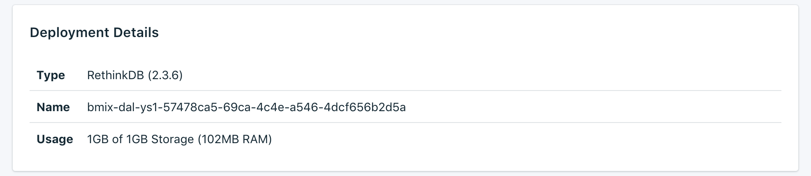

---

Copyright:
  Years: 2017
lastupdated: "2017-09-07"
---

{:new_window: target="_blank"}
{:shortdesc: .shortdesc}
{:screen: .screen}
{:codeblock: .codeblock}
{:pre: .pre}

# 서비스 개요

_개요_ 페이지에는 {{site.data.keyword.cloud}} Compose 데이터베이스에 대한 정보가 표시됩니다. 개요에는 필수 식별 정보와 현재 리소스 사용량이 포함되어 있습니다. 또한 도구와 함께 사용하거나 도구를 활용하여 데이터베이스에 연결할 수 있는 연결 문자열에 대한 섹션도 찾을 수 있습니다.

## 배치 세부사항

_배치 세부사항_ 패널에는 서비스의 세부사항이 표시됩니다.

### 유형

서비스에서 제공하는 데이터베이스의 유형과 서비스에서 사용하는 데이터베이스 버전입니다.

### 이름

서비스의 내부 ID입니다.

### 사용량

서비스 플랜에서 제공되는 데이터베이스의 크기와 스토리지의 양입니다.

## 연결 문자열

_연결 문자열_ 패널의 다른 탭에서 서비스에 대한 각 연결 문자열을 찾을 수 있습니다.

### HTTPS

일부 클라이언트 라이브러리에서 사용될 수 있으며 다른 라이브러리가 연결하는 데 필요한 모든 정보를 포함하는 URI 형식의 연결 문자열입니다. [외부 애플리케이션 연결](./connecting-external.html)에서 연결 문자열을 사용하여 연결하는 방법을 알아볼 수 있습니다.

### 관리

**관리** 탭의 링크는 _RabbitMQ 관리 콘솔_을 엽니다. 로그인 정보는 'rethinkdb://' 다음에 오고 '@' 앞에 있는 **HTTPS** 연결 문자열에 있습니다.

### SSL 인증서

Compose {{site.data.keyword.cloud_notm}} 서비스는 데이터베이스에 연결하는 데 사용할 수 있는 SSL 인증서를 제공합니다.
