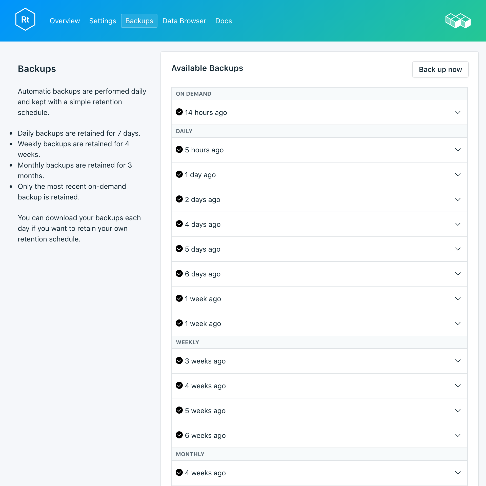
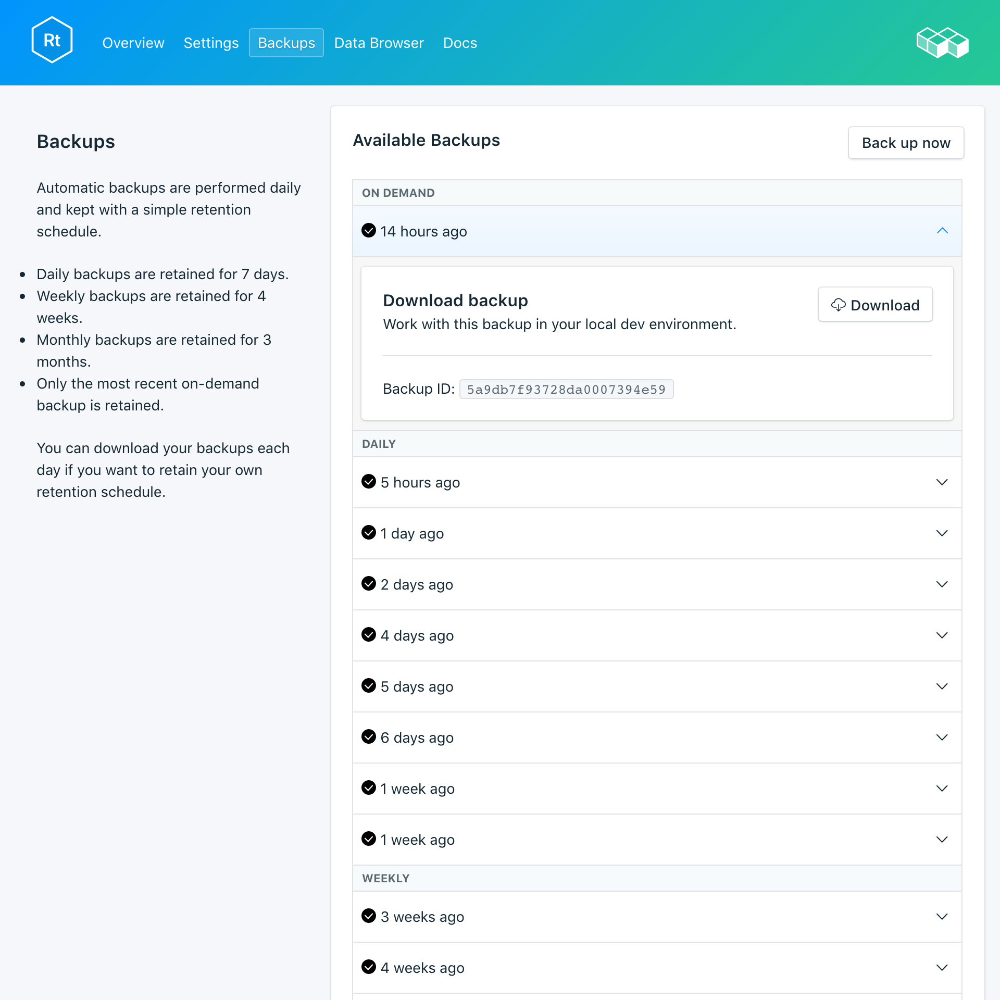

---

copyright:
  years: 2017,2018
lastupdated: "2018-03-02"
---

{:new_window: target="_blank"}
{:shortdesc: .shortdesc}
{:screen: .screen}
{:codeblock: .codeblock}
{:pre: .pre}

# Backups
{: #backups}

É possível criar e fazer download de backups na guia _Backups_ da página _Gerenciar_ de seu painel de serviço. Backups diários, mensais e on demand estão disponíveis. Eles são retidos de acordo com planejamento a seguir:

Tipo de backup|Planejamento de retenção
----------|-----------
Diárias|Os backups diários são retidos por 7 dias
Semanal|Backups semanais são retidos por 4 semanas
Mensal|Backups mensais são retidos por 3 meses
On demand|Um backup on demand é retido. O backup retido é sempre o backup on demand mais recente.
{: caption="Tabela 1. Planejamento de retenção de backup" caption-side="top"}

Planejamentos de backup e políticas de retenção são fixos. Se você precisar manter mais backups do que o planejamento de retenção permite, faça download de backups e retenha os arquivos de acordo com as suas necessidades de negócios.

## Visualizando backups existentes

Os backups diários de seu banco de dados são planejados automaticamente. Para visualizar seus backups existentes, navegue para a página *Gerenciar* de seu painel de serviço. 

  

Clique na linha correspondente para expandir as opções para qualquer backup disponível.

   

### Usando a API para visualizar backups existentes

Uma lista de backups está disponível no terminal `GET /2016-07/deployments/:id/backups`. O Terminal Foundation com o ID da instância de serviço e o ID da implementação são ambos mostrados na _Visão geral_ do serviço. Por exemplo: 
``` 
https://composebroker-dashboard-public.mybluemix.net/api/2016-07/instances/$INSTANCE_ID/deployments/$DEPLOYMENT_ID/backups
```  

## Criando um backup sob demanda

Além de backups planejados, é possível criar um backup manualmente. Para criar um backup manual, navegue para a página *Gerenciar* de seu painel de serviço e clique em *Fazer backup agora*.

### Usando a API para criar um backup

Envie uma solicitação POST para o terminal de backups para iniciar um backup manual: `POST /2016-07/deployments/:id/backups`. Ele é imediatamente retornado com o ID do recibo e as informações sobre o backup enquanto ele está sendo executado. Será necessário verificar no terminal de backups se o backup foi concluído e localizar o backup_id antes de usá-lo. Use `GET /2016-07/deployments/:id/backups/`.

## Fazendo download de um backup

Para fazer download de um backup, navegue para a página *Gerenciar* de seu painel de serviço e clique em *Fazer download* na linha correspondente para o backup que você deseja fazer download.

### Usando a API para fazer download de um backup

Localize o backup do qual gostaria de restaurar na página _Backups_ em seu serviço e copie o backup_id ou use o `GET /2016-07/deployments/:id/backups` para localizar um backup e seu backup_id por meio da API Compose. Em seguida, use o backup_id para localizar informações e um link de download para um backup específico: `GET /2016-07/deployments/:id/backups/:backup_id`.

## Conteúdos de backup

Os backups do RethinkDB usam o comando `dump` do utilitário de linha de comandos do RethinkDB em seu cluster de banco de dados em execução para fazer backup de sua implementação inteira. Isso salva os conteúdos do banco de dados e da tabela, bem como os metadados. `dump` usa alguns recursos de cluster, mas não bloqueará seus clientes e poderá ser executado em um cluster em tempo real. O Compose fornece backups para implementações do RethinkDB que estão em um formato que o `rethinkdb restore` pode usar diretamente.

## Usando um backup com um banco de dados local

Como seus backups do RethinkDB estão disponíveis para você fazer download, é possível deixar uma instância local de sua implementação funcionando.

1. Instalar o [rethink](https://www.rethinkdb.com/docs/install/)
2. Instale o [driver do python](https://www.rethinkdb.com/docs/install-drivers/python/) em seu caminho.
3. Faça download do arquivo de backup compactado. Você não precisa descompactar o archive de backup, as ferramentas do RethinkDB sabem como manipular isso.
4. Para acelerar o RethinkDB, execute o comando `rethinkdb` em uma janela do terminal e, em uma janela separada do terminal, navegue para o local do seu backup transferido por download e execute `rethinkdb restore backup.tar.gz`.

Abra uma janela do navegador e navegue para `locahost:8080` para ver a UI do RethinkDB e seus dados.

## Trazendo um Backup local para seu serviço

Se você tiver um arquivo de backup localmente que gostaria de restaurar para o {{site.data.keyword.composeForRethinkDB}}, será possível fazer isso usando `rethinkdb restore`.

1. Instalar o [rethink](https://www.rethinkdb.com/docs/install/)
2. Instale o [driver do python](https://www.rethinkdb.com/docs/install-drivers/python/) em seu caminho.
3. Faça download do certificado da página *Visão geral* de seu serviço e salve-o localmente como compose.cert.
4. Restaure do backup usando o comando a seguir:

  ```
  rethinkdb restore -c <host>:<port> --tls-cert compose.cert -p backup.tar.gz
  ```

Os valores de host e porta podem ser localizados em sua sequência de conexões, que você localizará na página *Visão geral* de seu serviço. O `-p` no comando solicitará a _Credencial de autenticação_.

**Nota:** se você estiver restaurando para uma implementação existente, poderá ser necessário usar `--force` para sobrescrever as tabelas existentes.
