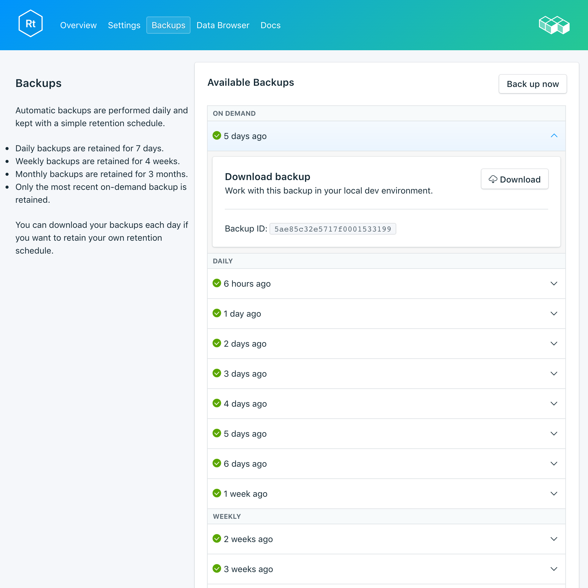

---

copyright:
  years: 2017,2018
lastupdated: "2018-03-02"
---

{:new_window: target="_blank"}
{:shortdesc: .shortdesc}
{:screen: .screen}
{:codeblock: .codeblock}
{:pre: .pre}

# 备份
{: #backups}

您可以从服务仪表板_管理_页面的_备份_选项卡创建和下载备份。有每日、每周、每月和按需备份可用。备份按照以下安排保留：

备份类型|保留安排
----------|-----------
每日|每日备份保留 7 天
每周|每周备份保留 4 周
每月|每月备份保留 3 个月
按需|保留一个按需备份。保留的备份始终是最新的按需备份。
{: caption="表 1. 备份保留安排" caption-side="top"}

备份安排和保留策略已经过修订。如果需要保留的备份数多于保留安排允许的量，那么应该根据业务需求下载备份并保留归档。

## 查看现有备份

数据库的每日备份会自动安排。要查看现有备份，请浏览至服务仪表板的*管理*页面。 

  

单击相应的行以展开任何可用备份的选项。

   

### 使用 API 查看现有备份

`GET /2016-07/deployments/:id/backups` 端点提供了备份列表。这将在服务的_概述_中显示基础端点以及服务实例标识和部署标识。例如： 
``` 
https://composebroker-dashboard-public.mybluemix.net/api/2016-07/instances/$INSTANCE_ID/deployments/$DEPLOYMENT_ID/backups
```  

## 随需应变创建备份

除了已安排的备份，您还可以手动创建备份。要创建手动备份，请浏览至服务仪表板的*管理*页面，然后单击*立即备份*。

### 使用 API 创建备份

向备份端点发送 POST 请求以启动手动备份：`POST /2016-07/deployments/:id/backups`。该请求在运行时会立即返回诀窍标识以及有关备份的信息。您必须检查备份端点以查看备份是否已完成，并在使用前查找其 backup_id。请使用 `GET /2016-07/deployments/:id/backups/`。

## 下载备份

要下载备份，请浏览至服务仪表板的*管理*页面，然后单击要下载的备份相应行中的*下载*。

### 使用 API 下载备份

在服务的_备份_页面上查找要从其复原的备份并复制 backup_id，或者通过 Compose API 使用 `GET /2016-07/deployments/:id/backups` 来查找备份及其 backup_id。然后，使用 backup_id 来查找特定备份的信息和下载链接：`GET /2016-07/deployments/:id/backups/:backup_id`。

## 备份内容

RethinkDB 备份使用正在运行的数据库集群上的 RethinkDB 命令行实用程序的 `dump` 命令，来备份整个部署。它会保存数据库、表内容以及元数据。`dump` 确实使用一些集群资源，但不会锁定客户机，并且可以在实时集群上运行。Compose 为 RethinkDB 部署提供备份，其格式可由 `rethinkdb restore` 直接使用。

## 将备份与本地数据库配合使用

由于 RethinkDB 备份可供您下载，所以您可以使部署的本地实例启动并运行。

1. 安装 [rethink](https://www.rethinkdb.com/docs/install/)
2. 在路径中安装 [python 驱动程序](https://www.rethinkdb.com/docs/install-drivers/python/)。
3. 下载压缩的备份文件。您不需要解压缩备份归档文件，RethinkDB 工具知道如何处理它。
4. 要旋转 RethinkDB，请在一个终端窗口中运行 `rethinkdb` 命令，而在另一个终端窗口中浏览到已下载备份的位置并运行 `rethinkdb restore backup.tar.gz`。

打开浏览器窗口并浏览至 `locahost:8080` 以查看 RethinkDB UI 和数据。

## 将本地备份引入您的服务

如果您在本地拥有要复原到 {{site.data.keyword.composeForRethinkDB}} 的备份文件，那么可以使用 `rethinkdb restore` 完成此操作。

1. 安装 [rethink](https://www.rethinkdb.com/docs/install/)
2. 在路径中安装 [python 驱动程序](https://www.rethinkdb.com/docs/install-drivers/python/)。
3. 从服务的*概述*页面下载证书，并在本地将其保存为 compose.cert。
4. 使用以下命令从备份复原：

  ```
  rethinkdb restore -c <host>:<port> --tls-cert compose.cert -p backup.tar.gz
  ```

可以在服务的*概述*页面上找到连接字符串中的主机和端口值。命令中的 `-p` 将提示输入_认证凭证_。

**注：**如果要复原到现有部署，那么可能必须使用 `--force` 来覆盖现有表。
