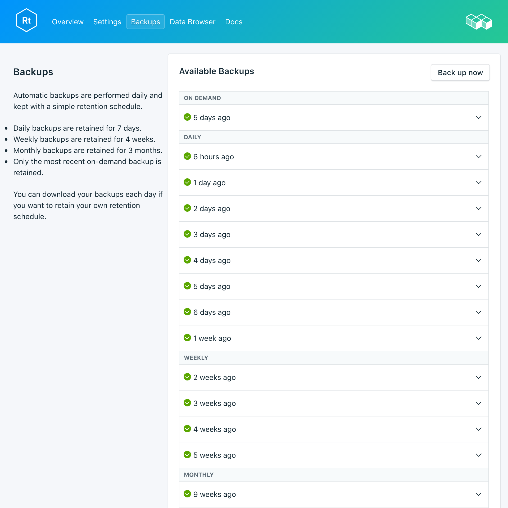
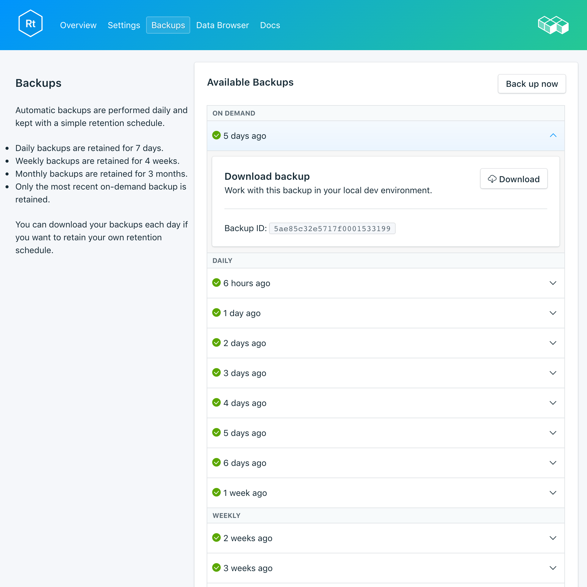

---

copyright:
  years: 2017,2018
lastupdated: "2018-03-02"
---

{:new_window: target="_blank"}
{:shortdesc: .shortdesc}
{:screen: .screen}
{:codeblock: .codeblock}
{:pre: .pre}

# 備份
{: #backups}

您可以從服務儀表板的_管理_ 頁面的_備份_ 標籤中，建立及下載備份。有每日、每週、每月及隨需應變備份可供使用。系統會根據下列排程保留它們：

備份類型|保留排程
----------|-----------
每日|每日備份保留 7 日
每週|每週備份保留 4 週
每月|每月備份保留 3 個月
隨需應變|保留一份隨需應變備份。保留的備份一律是最新的隨需應變備份。
{: caption="表 1. 備份保留排程" caption-side="top"}

備份排程與保留原則是固定的。如果您需要保留的備份數目超過保留排程所容許的數目，則應該根據您的商業需求下載備份及保留保存檔。

## 檢視現有備份

資料庫的每日備份是自動排定的。若要檢視現有備份，請導覽至服務儀表板的*管理* 頁面。 

  

按一下對應列來展開任何可用備份的選項。

   

### 使用 API 檢視現有備份

備份的清單位於 `GET /2016-07/deployments/:id/backups` 端點上。具有服務實例 ID 及部署 ID 的「基礎端點」都會顯示在服務的_概觀_ 中。例如： 
``` 
https://composebroker-dashboard-public.mybluemix.net/api/2016-07/instances/$INSTANCE_ID/deployments/$DEPLOYMENT_ID/backups
```  

## 依需求建立備份

除了排定的備份外，您也可以手動建立備份。若要建立手動備份，請導覽至服務儀表板的*管理* 頁面，然後按一下*立即備份*。

### 使用 API 建立備份

請將 POST 要求傳送至 backups 端點，以起始手動備份：`POST /2016-07/deployments/:id/backups`。它會立即傳回執行中備份的秘訣 ID 及相關資訊。您必須檢查 backups 端點，以查看備份是否已完成，並在使用之前找到其 backup_id。請使用 `GET /2016-07/deployments/:id/backups/`。

## 下載備份

若要下載備份，請導覽至服務儀表板的*管理* 頁面，然後針對您要下載的備份，按一下對應列中的*下載*。

### 使用 API 下載備份

在服務的_備份_ 頁面上，尋找您要從中還原的備份，並複製 backup_id，或透過 Compose API 使用 `GET /2016-07/deployments/:id/backups` 尋找備份及其 backup_id。然後，使用 backup_id 來尋找特定備份的資訊及下載鏈結：`GET /2016-07/deployments/:id/backups/:backup_id`。

## 備份內容

RethinkDB 備份會在執行中的資料庫叢集上，從 RethinkDB 指令行公用程式，使用 `dump` 指令來備份整個部署。它會儲存資料庫和表格內容，以及 meta 資料。`dump` 會使用一些叢集資源，但不會將您的用戶端鎖定，而且可以在即時叢集上執行。Compose 提供 RethinkDB 部署的備份，其具有 `rethinkdb restore` 可以直接使用的格式。

## 使用備份與本端資料庫搭配

因為 RethinkDB 備份可供您下載，所以您可以讓部署的本端實例啟動並執行。

1. 安裝 [rethink](https://www.rethinkdb.com/docs/install/)
2. 在您的路徑中安裝 [Python 驅動程式](https://www.rethinkdb.com/docs/install-drivers/python/)。
3. 下載您的壓縮備份檔。您不需要解壓縮備份保存檔，因為 RethinkDB 工具知道如何處理它。
4. 若要啟動 RethinkDB，請在終端機視窗中執行 `rethinkdb` 指令，然後在個別的終端機視窗中導覽至已下載備份的位置，並執行 `rethinkdb restore backup.tar.gz`。

開啟瀏覽器視窗，並導覽至 `locahost:8080`，以查看 RethinkDB 使用者介面及您的資料。

## 將本端備份帶至您的服務

如果您在本端具有備份檔，而且想要將它還原至 {{site.data.keyword.composeForRethinkDB}}，則可以使用 `rethinkdb restore` 來執行此作業。

1. 安裝 [rethink](https://www.rethinkdb.com/docs/install/)
2. 在您的路徑中安裝 [Python 驅動程式](https://www.rethinkdb.com/docs/install-drivers/python/)。
3. 從服務的*概觀* 頁面下載憑證，並在本端將它儲存為 compose.cert。
4. 使用下列指令從備份中還原：

  ```
  rethinkdb restore -c <host>:<port> --tls-cert compose.cert -p backup.tar.gz
  ```

主機及埠值位在您的連線字串中，您可以在服務的*概觀* 頁面上找到它們。指令中的 `-p` 將提示您輸入_鑑別認證_。

**附註：**如果您要還原至現有部署，則可能必須使用 `--force` 來改寫現有表格。
