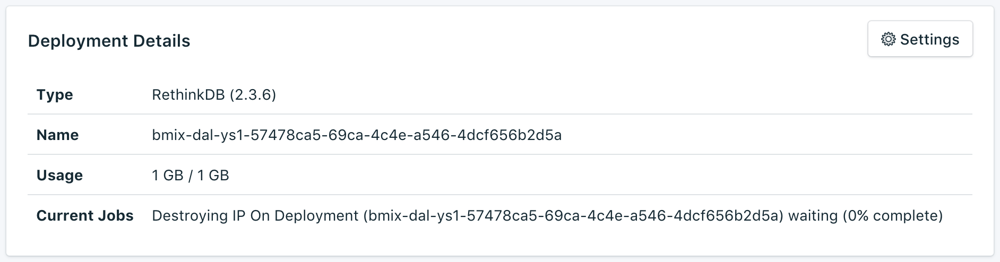

---

Copyright:
  Years: 2017
lastupdated: "2017-09-07"
---

{:new_window: target="_blank"}
{:shortdesc: .shortdesc}
{:screen: .screen}
{:codeblock: .codeblock}
{:pre: .pre}

# 服務概觀

_概觀_ 頁面顯示 {{site.data.keyword.cloud}} Compose 資料庫的相關資訊。概觀包括基本識別資訊及現行資源使用。您也會找到一個區段，以尋找可與工具搭配使用的連線字串，或利用工具來連接至您的資料庫。

## 部署詳細資料

_部署詳細資料_ 畫面顯示服務的詳細資料。

### 類型

服務所提供的資料庫類型，以及服務使用的資料庫版本。

### 名稱

服務的內部 ID。

### 用量

服務方案所提供的資料庫大小及儲存空間數量。

## 連線字串

您將在_連線字串_ 畫面的另一個標籤中，找到服務的每一個「連線字串」。

### HTTPS

URI 格式的連線字串，可由某些用戶端程式庫使用，且包含其他程式庫進行連接時所需的一切資訊。您可以在[連接外部應用程式](./connecting-external.html)中，瞭解如何使用「連線字串」來連接。

### 管理

**管理**標籤上的鏈結將開啟 _RabbitMQ 管理主控台_。登入資訊在 **HTTPS** 連線字串中，而此連線字串位於 'rethinkdb://' 後面，但在 '@' 前面。

### SSL 憑證

您的 Compose {{site.data.keyword.cloud_notm}} 服務提供您可用來連接至資料庫的 SSL 憑證。
